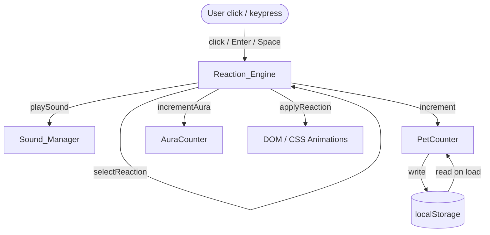

# Design Document — Cat Clicker App

## Overview

The Cat Clicker App is a single-page web application delivered as one self-contained HTML file. Users click (or keyboard-activate) a minimalist cat graphic to trigger one of four randomised reactions. Each interaction increments a persistent pet counter and plays audio feedback. The app is built entirely with HTML5, Tailwind CSS loaded from CDN, and Vanilla JavaScript — no build tools, no frameworks, no bundlers.

### Design Goals

- Keep the entire application in a **single `index.html` file** for zero-dependency deployment.
- All JavaScript lives in one or more `<script>` blocks; all custom animations are declared in the Tailwind config block.
- Components are logically separated as plain JavaScript objects/functions even though they share a single file, making the code readable and testable.
- The Reaction_Engine exposes a **pure selection function** (`selectReaction(n)`) that maps an integer to a reaction type — the only randomness is the `Math.random()` call that feeds it, keeping the core logic deterministic and testable.

---

## Architecture

The app follows a simple event-driven architecture with three runtime layers:



**Data flow on each click:**

1. Click/keypress event fires on `Cat_Element`.
2. `Reaction_Engine.trigger()` is called.
3. Any in-progress reaction is cancelled (timers cleared, classes removed).
4. `Math.random()` produces an integer 1–100; `selectReaction(n)` maps it to a reaction type.
5. The chosen reaction's `apply()` function runs: adds CSS classes, renders `Text_Overlay`, calls `Sound_Manager`.
6. `PetCounter.increment()` is called; the new value is written to `localStorage` and the display is updated.
7. If the reaction is Happy, `AuraCounter.increment(5)` is called.
8. A `setTimeout` fires after the reaction's duration; cleanup removes classes, hides overlays, and marks the engine as idle.

---

## Components and Interfaces

### 1. Tailwind Config Block

Defined in an inline `<script>` tag before the Tailwind CDN script.

```js
window.tailwind = { config: {
  theme: {
    extend: {
      keyframes: {
        wiggle: {
          '0%':   { transform: 'translateX(0px)' },
          '25%':  { transform: 'translateX(-10px)' },
          '50%':  { transform: 'translateX(10px)' },
          '75%':  { transform: 'translateX(-10px)' },
          '100%': { transform: 'translateX(0px)' },
        },
        zzzFloat: {
          '0%':   { opacity: '0', transform: 'translateY(0px)' },
          '100%': { opacity: '1', transform: 'translateY(-30px)' },
        },
      },
      animation: {
        wiggle:    'wiggle 0.6s ease-in-out 1',
        zzz:       'zzzFloat 1s ease-out 1',
      },
    },
  },
}};
```

> **Design decision:** The `wiggle` keyframe encodes all four oscillation steps directly so the animation utility can be applied with `repeat: 1`. This avoids needing a separate iteration count on the utility class.

---

### 2. Reaction_Engine

The central coordinator. Exposed as a plain object `ReactionEngine`.

| Method | Signature | Description |
|---|---|---|
| `trigger()` | `() → void` | Entry point for every click/keypress. Cancels active reaction, picks new one, applies it. |
| `selectReaction` | `(n: int) → ReactionType` | Pure function. Maps integer 1–100 to `'happy' \| 'purring' \| 'sleeping' \| 'zoomies'`. |
| `cancel()` | `() → void` | Clears all active timers, removes animation classes, hides overlays. |
| `applyHappy()` | `() → void` | Applies Happy reaction. |
| `applyPurring()` | `() → void` | Applies Purring reaction. |
| `applySleeping()` | `() → void` | Applies Sleeping reaction. |
| `applyZoomies()` | `() → void` | Applies Zoomies reaction. |

`selectReaction` mapping:

| Input range | Output |
|---|---|
| 1 – 40 | `'happy'` |
| 41 – 70 | `'purring'` |
| 71 – 90 | `'sleeping'` |
| 91 – 100 | `'zoomies'` |

---

### 3. Sound_Manager

Thin wrapper around `new Audio()`.

| Method | Signature | Description |
|---|---|---|
| `play(assetKey)` | `(string) → void` | Creates and plays an `Audio` instance. Catches all errors silently. |
| `stop(instance)` | `(Audio) → void` | Pauses and resets the given `Audio` instance. |

Asset keys: `'click'` (default pop/meow), `'zoomies'` (zoom/boing), `'purr'` (purring loop).

All errors from `audio.play()` (autoplay policy, network failure) are caught in a `.catch(() => {})` handler — the reaction always continues regardless.

---

### 4. PetCounter

| Method / Property | Description |
|---|---|
| `value` | Current integer count. |
| `init()` | Reads `localStorage['cat-clicker-pet-count']`. Validates as non-negative integer; defaults to 0 if absent or invalid. |
| `increment()` | Adds 1 to `value`, writes to `localStorage`, calls `updateDisplay()`. |
| `updateDisplay()` | Sets the counter element's `textContent` to `"Total Pets: {value} ✨"`. |
| `format(n)` | Pure function. Returns `"Total Pets: {n} ✨"` for any non-negative integer `n`. |

---

### 5. AuraCounter

| Method / Property | Description |
|---|---|
| `value` | Current integer aura score. |
| `increment(amount)` | Adds `amount` to `value`, updates display. |
| `updateDisplay()` | Sets the aura element's `textContent`. |

---

### 6. Text_Overlay

A single `<div>` element rendered above `Cat_Element`, reused across reactions.

| Attribute | Value |
|---|---|
| `aria-live` | `"polite"` |
| `role` | `"status"` |

The overlay is shown/hidden by toggling a CSS visibility class. Fade-out is applied via a short CSS transition on `opacity` before the element is hidden.

---

### 7. Cat_Element

An inline SVG rendered directly in the HTML. Key attributes:

| Attribute | Value |
|---|---|
| `tabindex` | `"0"` |
| `aria-label` | `"Pet the cat"` |
| `role` | `"img"` |
| `style` | `cursor: pointer` |

Keyboard events (`keydown` with `key === 'Enter'` or `key === ' '`) are attached to this element alongside the `click` event.

---

## Data Models

### ReactionType (string enum)

```
'happy' | 'purring' | 'sleeping' | 'zoomies'
```

### ReactionConfig

Each reaction is described by a config record:

```js
{
  type:        ReactionType,         // identifier
  duration:    number,               // ms before cleanup
  animClass:   string | null,        // Tailwind animation class to add/remove
  transform:   string | null,        // inline CSS transform (sleeping only)
  overlayText: string,               // message shown in Text_Overlay
  soundKey:    string,               // key passed to Sound_Manager.play()
  auraBonus:   number,               // 0 for most reactions; 5 for 'happy'
}
```

| Reaction | duration | animClass | transform | overlayText | soundKey | auraBonus |
|---|---|---|---|---|---|---|
| happy | 1000 | `animate-bounce` | — | `"YAY! 😸 (+5 Aura)"` | `'click'` | 5 |
| purring | 2000 | `animate-pulse` | — | `"Purrr... 😻"` | `'purr'` | 0 |
| sleeping | 1500 | — | `scale(0.9) rotate(6deg)` | `"shh... 😴"` | `'click'` | 0 |
| zoomies | 800 | `animate-wiggle` | — | `"ZOOMIES!! 💨💨"` | `'zoomies'` | 0 |

### AppState

Runtime state managed by the `ReactionEngine`:

```js
{
  isIdle:          boolean,    // true when no reaction is running
  activeReaction:  ReactionType | null,
  activeTimers:    number[],   // setTimeout IDs for cleanup
}
```

### PersistedState (localStorage)

| Key | Type | Notes |
|---|---|---|
| `cat-clicker-pet-count` | string (integer) | Written on every increment. Read on load. |

---

## Correctness Properties

*A property is a characteristic or behavior that should hold true across all valid executions of a system — essentially, a formal statement about what the system should do. Properties serve as the bridge between human-readable specifications and machine-verifiable correctness guarantees.*

### Property 1: Reaction selection covers the entire input domain

*For any* integer `n` in the range 1–100 inclusive, `selectReaction(n)` SHALL return exactly one of `'happy'`, `'purring'`, `'sleeping'`, or `'zoomies'`, and never `null` or an undefined value.

**Validates: Requirements 4.1, 5.1, 6.1, 7.1**

---

### Property 2: Reaction selection is deterministic and partition-correct

*For any* integer `n` in the range 1–100 inclusive, `selectReaction(n)` SHALL return:
- `'happy'` if and only if `1 ≤ n ≤ 40`
- `'purring'` if and only if `41 ≤ n ≤ 70`
- `'sleeping'` if and only if `71 ≤ n ≤ 90`
- `'zoomies'` if and only if `91 ≤ n ≤ 100`

No two reaction types shall be returned for the same `n`.

**Validates: Requirements 4.1, 5.1, 6.1, 7.1**

---

### Property 3: Pet_Counter increment invariant

*For any* non-negative integer `n` representing the current Pet_Counter value, after one call to `PetCounter.increment()`, the Pet_Counter value SHALL equal `n + 1`.

**Validates: Requirements 3.2**

---

### Property 4: Aura_Counter increment invariant

*For any* non-negative integer `n` representing the current Aura_Counter value, when the Happy Reaction is applied, the Aura_Counter value SHALL equal `n + 5`.

**Validates: Requirements 4.5**

---

### Property 5: localStorage round-trip for Pet_Counter

*For any* non-negative integer `n`, writing `n` to `localStorage['cat-clicker-pet-count']` via `PetCounter.increment()` and then reading it back via `PetCounter.init()` SHALL produce the same integer `n`.

**Validates: Requirements 10.4, 10.5**

---

### Property 6: Invalid localStorage value defaults to 0

*For any* string `s` that is not a valid non-negative integer (including `null`, `undefined`, the empty string, negative numbers, floats, or non-numeric strings), calling `PetCounter.init()` with `s` as the stored value SHALL initialize Pet_Counter to 0.

**Validates: Requirements 10.1, 10.5**

---

### Property 7: Counter display text formatting

*For any* non-negative integer `n`, `PetCounter.format(n)` SHALL return the string `"Total Pets: " + n + " ✨"`, with no extra whitespace, no different characters, and no omission of the emoji.

**Validates: Requirements 10.2**

---

## Error Handling

### Audio Failures

All calls to `Audio.play()` return a Promise that may reject (browser autoplay policy, missing file, network error). The `Sound_Manager.play()` method wraps every call in a `.catch(() => {})` to silently discard errors. The reaction animation always proceeds regardless of audio state.

**Rationale:** Audio is an enhancement, not core functionality. Blocking the UI on audio errors would degrade the experience unnecessarily.

### localStorage Failures

Reading from `localStorage` is wrapped in a `try/catch`. If `localStorage` is unavailable (private browsing restrictions in some environments), `PetCounter` initialises to 0 and operates in memory only — writes are silently skipped.

### Invalid Counter Values

If the value at `cat-clicker-pet-count` is not a parseable non-negative integer, `parseInt` will return `NaN` or a negative number. The initialisation logic guards with:

```js
const raw = parseInt(localStorage.getItem('cat-clicker-pet-count'), 10);
this.value = (Number.isInteger(raw) && raw >= 0) ? raw : 0;
```

### Concurrent Reaction Interrupts

When a new click arrives while a reaction is active, `ReactionEngine.cancel()` clears all pending `setTimeout` IDs before applying the new reaction. This prevents orphaned timers from removing classes or elements that now belong to the new reaction.

### Missing Sound Assets

If a sound file path is incorrect or the network request fails, the `Audio` object fires an error event. The `Sound_Manager.play()` `.catch()` handler covers this case. No user-visible error is shown.

---

## Testing Strategy

### Scope of Automated Tests

Because this is a single-file browser application, the testing strategy distinguishes between:

- **Pure logic** — functions with no DOM or browser API dependencies (testable with any JS test runner like Vitest or Jest, imported as modules).
- **DOM-integrated behavior** — requires a browser or jsdom environment (Vitest with jsdom).
- **Visual/animation** — requires manual verification or screenshot regression tools.

### Unit Tests (example-based)

Target the following with concrete examples:

| Area | What to verify |
|---|---|
| `Cat_Element` DOM structure | SVG contains face, ears, and eyes; `tabindex="0"`, `aria-label="Pet the cat"` present |
| `Cat_Element` idle state | No animation class or transform applied on load |
| `Cat_Element` cursor style | `cursor: pointer` applied |
| Reaction text overlay | Correct message string per reaction type |
| Sound routing | `Sound_Manager.play('click')` called for Happy/Purring/Sleeping; `'zoomies'` called for Zoomies |
| Audio failure | Reaction completes when `Audio.play()` rejects |
| Reaction duration cleanup | CSS classes removed after the correct timeout |
| Accessibility | `aria-live="polite"` on Text_Overlay; Enter/Space triggers reaction |
| Tailwind config structure | `wiggle` and `zzzFloat` keyframes present with correct stop values |

### Property-Based Tests (Vitest + fast-check)

Each property test uses [fast-check](https://github.com/dubzzz/fast-check) and runs a minimum of **100 iterations**.

| Property | Generator | Assertion |
|---|---|---|
| **P1 & P2** — Reaction selection mapping | `fc.integer({ min: 1, max: 100 })` | Correct reaction type per range; no null/undefined |
| **P3** — Pet_Counter increment | `fc.integer({ min: 0, max: 1_000_000 })` | `counter + 1` after increment |
| **P4** — Aura_Counter increment | `fc.integer({ min: 0, max: 1_000_000 })` | `aura + 5` after Happy reaction |
| **P5** — localStorage round-trip | `fc.integer({ min: 0, max: 1_000_000 })` | Read-back equals written value |
| **P6** — Invalid localStorage defaults to 0 | `fc.oneof(fc.string(), fc.constant(null), fc.float(), fc.integer({ max: -1 }))` | Init value is 0 |
| **P7** — Display text format | `fc.integer({ min: 0, max: 1_000_000 })` | Exact string `"Total Pets: {n} ✨"` |

**Test tag format:** `// Feature: cat-clicker-app, Property {number}: {property_text}`

### Integration / Manual Verification

| Scenario | Method |
|---|---|
| Glassmorphism container appearance | Visual inspection |
| Font loading and fallback | Manual check with devtools network throttling |
| Full-viewport gradient background | Visual inspection |
| Animation timings (bounce, pulse, wiggle, zzz) | Manual observation + devtools animation panel |
| Audio playback per reaction | Manual test in browser |
| localStorage persistence across page reload | Manual test (open DevTools → Application → localStorage) |
| Keyboard navigation and focus ring visibility | Manual test with Tab + Enter/Space keys |
| Screen reader announcement of Text_Overlay | Manual test with NVDA/VoiceOver |

### Notes on PBT Exclusions

The following areas are **not** suitable for property-based testing and are covered by example-based or manual tests instead:

- CSS layout, animations, and visual styling — no computable output to assert on
- Audio side effects — non-deterministic timing and browser policy restrictions
- Tailwind config structure — declarative configuration, not a function with input variation
- DOM rendering and animation classes — integration/jsdom tests are more appropriate
